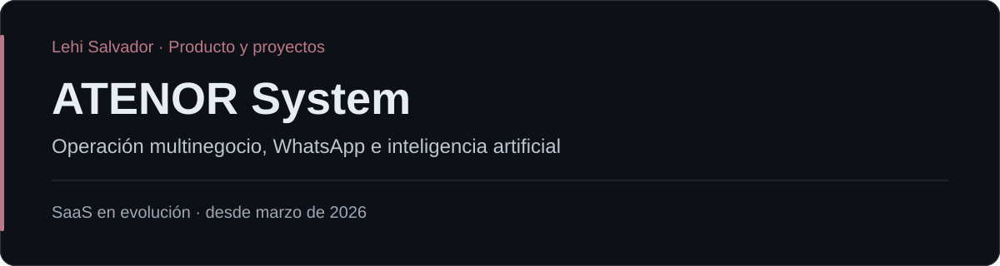

# ATENOR System

ATENOR System es una plataforma multinegocio del ecosistema Salva Systems. Busca reunir comunicación, clientes, pedidos y operación en un mismo producto, con automatizaciones e inteligencia artificial configurable según necesidades del negocio.

## Participación

Lehi Salvador — liderazgo de producto, levantamiento de requerimientos, reglas de negocio, diseño de workflows, planificación, pruebas, coordinación del desarrollo y validación con negocios.

## Alcance

- Centralización de WhatsApp y conversaciones.
- Organización de clientes, pedidos y operación.
- Automatizaciones adaptadas a reglas de negocio.
- Inteligencia artificial configurable.
- Modelo multinegocio para reutilizar el producto en distintas implementaciones.

## Estado y contexto

Desde marzo de 2026. Aproximadamente **cuatro implementaciones activas en negocios del sur de Tamaulipas**. El producto continúa evolucionando como SaaS reutilizable. Este repositorio reúne documentación pública de producto y alcance.

## Enlaces

- [Portafolio de Lehi Salvador](https://github.com/LehiSalvador)
- [Salva Systems](https://salvasystems.site)

## Documentación de producto

[Contexto y alcance](docs/overview.md) · [Hoja de ruta pública](docs/roadmap.md)
